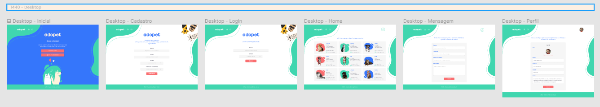
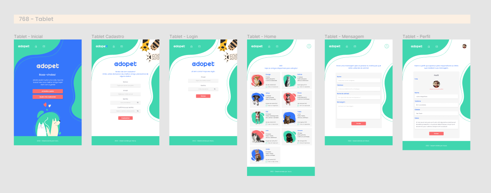
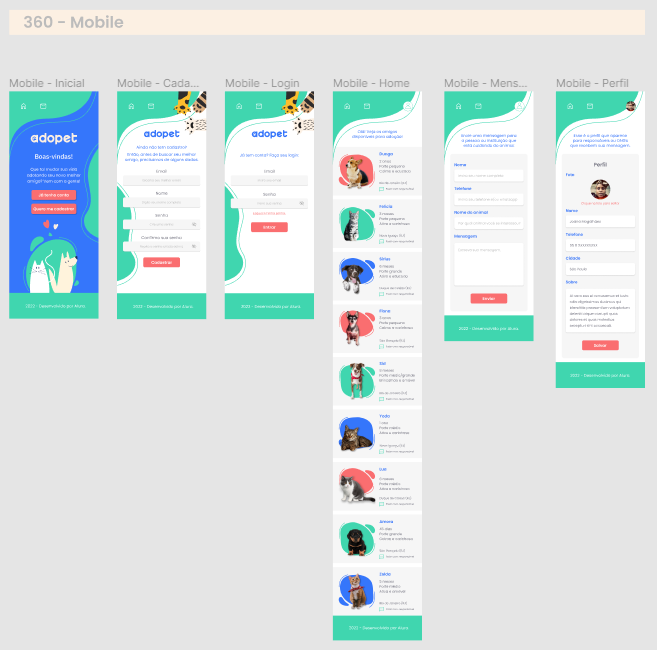

# 🎯 Challenge Backend 6ª Edição - Alura

---

## 📋 Descrição do Projeto

Projeto criado durante um evento da escola online de tecnologia Alura (<a>https://www.alura.com.br/</a>) 
onde todos os alunos receberam um conjunto de informações via Trello (<a>https://trello.com/b/pvyoHDfT/challenge-backend-6</a>) e 
instruções via lives ao vivo e videos gravados para criarem uma API REST para o projeto
Adopet que atendesse as necessidades do seguinte layout disponibilizado
pelo Figma:

A ideia do projeto é um aplicativo que permita a empresas, ongs e outras
organizações registrarem animais que foram recolhidos das ruas ou 
recebidos em canis para serem adotados e, no mesmo aplicativo, tutores,
que serão pessoas interessadas em adotar um animal de estimação, poderão
se cadastrar e solicitar a adoção de um novo amigo de 4 patas 🐶🐱.

Todos os alunos tem a total liberdade de escolherem as tecnologias
utilizadas, assim como a forma de elaboração das etapas do projeto.

Atualmente, na semana 1, foi disponibilizado no Trello as necessidades
para a criação da entidade Tutor, que será o usuário interessado em adotar 
um pet.

---

### 📜 Tarefas da Semana 1

- [x] Requisição para cadastrar um novo tutor;
- [x] Requisição para alterar um ou mais campos de um tutor;
- [x] Requisição para listar todos os tutores;
- [x] Requisição para detalhar um tutor por id;
- [x] Requisição para deletar um tutor por id;

---
